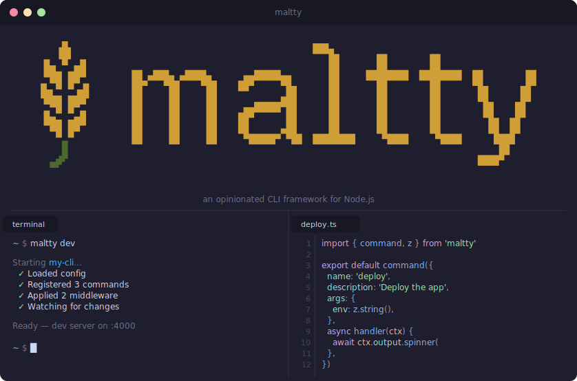

<!--
  RENAME IN FLIGHT — formerly known as `kidd` / `@kidd-cli/*`.
  - npm packages renamed to `@maltty/*` (binary: `maltty`)
  - Logo / banner SVGs still show the old name and will be replaced once the new artwork lands
  - GitHub repo move to `thebytefarm/maltty` is pending
-->

> [!IMPORTANT]
> **Rename in flight: `kidd` → `maltty`**
>
> This framework was previously published as `@kidd-cli/*` with the `kidd` binary. It is being renamed end-to-end to `maltty` (`@maltty/*`, binary `maltty`). Logos and the GitHub repo URL will be updated next.
>
> If you are landing here from a search for `kidd`, you are in the right place.

<div align="center">
  
  <p><strong>An opinionated CLI framework for Node.js. Convention over configuration, end-to-end type safety.</strong></p>

<a href="https://github.com/thebytefarm/maltty/actions/workflows/ci.yml"></a>
<a href="https://www.npmjs.com/package/@maltty/core"></a>
<a href="https://github.com/thebytefarm/maltty/blob/main/LICENSE"></a>

<a href="https://maltty.dev">📖 Documentation</a> &nbsp;&nbsp;&nbsp;·&nbsp;&nbsp;&nbsp; <a href="https://github.com/thebytefarm/maltty/issues">🐛 Issues</a>

</div>

## Features

- 🧰 **Batteries included** — Config, auth, prompts, logging, output, and middleware built in
- 📁 **File-system autoloading** — Drop a file in `commands/`, get a command
- ⚡ **Build and compile** — Bundle your command tree or produce cross-platform standalone binaries
- 🚀 **Two files to a full CLI** — Define a schema, write a handler, done
- 🛠️ **Developer experience** — Scaffolding, hot reload, route inspection, and diagnostics out of the box

## Install

```bash
npm install @maltty/core
```

## Usage

### Define your CLI

```ts
// index.ts
import { cli } from '@maltty/core'
import { z } from 'zod'

await cli({
  name: 'deploy',
  version: '0.1.0',
  config: {
    schema: z.object({
      registry: z.string().url(),
      region: z.enum(['us-east-1', 'eu-west-1']),
    }),
  },
})
```

### Add a command

```ts
// commands/deploy.ts
import { command } from '@maltty/core'
import { z } from 'zod'

export default command({
  description: 'Deploy to the configured registry',
  args: z.object({
    tag: z.string().describe('Image tag to deploy'),
    dry: z.boolean().default(false).describe('Dry run'),
  }),
  handler: async (ctx) => {
    ctx.log.info(`Deploying ${ctx.args.tag} to ${ctx.config.region}`)
  },
})
```

### Add a screen

```tsx
// commands/dashboard.tsx
import { screen, Box, Text, useScreenContext } from '@maltty/core/ui'
import { z } from 'zod'

function Dashboard({ env }: { env: string }) {
  const ctx = useScreenContext()
  return (
    <Box flexDirection="column">
      <Text bold>Dashboard — {env}</Text>
      <Text>Region: {ctx.config.region}</Text>
    </Box>
  )
}

export default screen({
  description: 'Launch an interactive dashboard',
  options: z.object({
    env: z.string().default('staging').describe('Target environment'),
  }),
  render: Dashboard,
})
```

### Run it

```bash
maltty dev -- deploy --tag v1.2.3         # dev mode
maltty build                              # bundle
maltty compile                            # standalone binary
```

## License

[MIT](LICENSE)
