# Architecture

High-level overview of how maltty is structured, its design philosophy, and how data flows through the system.

## Overview

maltty is a CLI framework for building composable, type-safe command-line tools. It provides a modular architecture with commands, middleware, context, and config layers that combine to build CLIs with full type inference and a rich terminal UI.

The codebase follows a functional, immutable, composition-first design. There are no classes, no `let`, no `throw` statements, and no loops. Errors are returned as `Result` tuples. Side effects (process exit, terminal output) are pushed to the outermost edges.

## Package Ecosystem

```
packages/
├── core/            # Core CLI framework (commands, middleware, context, config)
├── cli/             # CLI entrypoint and DX tooling (init, dev, build, compile)
├── config/          # Configuration loading, validation, and schema (internal)
├── utils/           # Shared functional utilities (internal)
└── bundler/         # tsdown bundling and binary compilation (internal)
```

| Package           | Purpose                                                       |
| ----------------- | ------------------------------------------------------------- |
| `@maltty/core`    | Core framework: `cli()`, `command()`, `middleware()`, context |
| `@maltty/cli`     | DX companion CLI: scaffolding, dev mode, build, compile       |
| `@maltty/config`  | Configuration loading, validation, and schema (internal)      |
| `@maltty/utils`   | Shared functional utilities (internal)                        |
| `@maltty/bundler` | tsdown bundling and binary compilation (internal)             |

## Layers

```mermaid
%%{init: {
  'theme': 'base',
  'themeVariables': {
    'primaryColor': '#313244',
    'primaryTextColor': '#cdd6f4',
    'primaryBorderColor': '#6c7086',
    'lineColor': '#89b4fa',
    'secondaryColor': '#45475a',
    'tertiaryColor': '#1e1e2e',
    'background': '#1e1e2e',
    'mainBkg': '#313244',
    'clusterBkg': '#1e1e2e',
    'clusterBorder': '#45475a'
  },
  'flowchart': { 'curve': 'basis', 'padding': 15 }
}}%%
flowchart TB
    subgraph entry ["Entry Layer"]
        INDEX(["cli/src/index.ts"])
    end

    subgraph core ["Core Layer"]
        CLICORE(["cli"])
        CMD(["command"])
        MW(["middleware"])
        AUTO(["autoload"])
        CTX(["context"])
    end

    subgraph lib ["Lib Layer"]
        CONFIG(["config"])
        STORE(["store"])
        LOGGER(["logger"])
        FORMAT(["format"])
        PROMPTS(["prompts"])
        ERRORS(["errors"])
        RESULT(["result"])
        PROJECT(["project"])
    end

    INDEX --> CLICORE
    CLICORE --> CMD & MW & AUTO & CTX
    CTX --> LOGGER & STORE & FORMAT & PROMPTS & ERRORS
    CMD & MW --> CTX

    classDef core fill:#313244,stroke:#89b4fa,stroke-width:2px,color:#cdd6f4
    classDef gateway fill:#313244,stroke:#fab387,stroke-width:2px,color:#cdd6f4
    classDef agent fill:#313244,stroke:#a6e3a1,stroke-width:2px,color:#cdd6f4
    classDef external fill:#313244,stroke:#f5c2e7,stroke-width:2px,color:#cdd6f4

    class INDEX external
    class CLICORE gateway
    class CMD,MW,AUTO,CTX core
    class CONFIG,STORE,LOGGER,FORMAT,PROMPTS,ERRORS,RESULT,PROJECT agent

    style entry fill:#181825,stroke:#f5c2e7,stroke-width:2px
    style core fill:#181825,stroke:#fab387,stroke-width:2px
    style lib fill:#181825,stroke:#89b4fa,stroke-width:2px
```



### Entry Layer

**Package:** `packages/cli`

The CLI binary entrypoint. Calls `cli()` from `@maltty/core` with the CLI name, version, commands, and middleware. This is the only layer that reads `package.json` for version and calls `process.exit`.

### Core Layer

**Package:** `packages/core/src/`

The framework primitives:

| Module          | Purpose                                                |
| --------------- | ------------------------------------------------------ |
| `cli.ts`        | Entry function that wires yargs, config, and context   |
| `command.ts`    | Factory for creating typed commands                    |
| `middleware.ts` | Factory and pipeline runner for middleware composition |
| `autoloader.ts` | Auto-discovery and dynamic import of command files     |
| `context/`      | Context creation, types, and error handling            |

### Lib Layer

**Package:** `packages/core/src/lib/`

Shared utilities consumed by the core and extension layers:

| Module        | Purpose                                                             |
| ------------- | ------------------------------------------------------------------- |
| `config.ts`   | Config file discovery, parsing, Zod validation                      |
| `store.ts`    | File-backed JSON store (local and global)                           |
| `logger.ts`   | Structured logging with `@clack/prompts`                            |
| `format/`     | Pure format functions (check, finding, code-frame, tally, duration) |
| `prompts.ts`  | Interactive prompts and spinner via `@clack/prompts`                |
| `errors.ts`   | Sensitive data redaction and sanitization                           |
| `result.ts`   | `Result<T, E>` type constructors (`ok`, `err`)                      |
| `validate.ts` | Zod schema validation returning Result tuples                       |
| `project.ts`  | Git project root detection and submodule handling                   |

## Context

The `Context` is the central object threaded through every middleware and command handler. It carries all request-scoped data and utilities for a single CLI invocation.

| Property  | Type                           | Mutable | Description                                                |
| --------- | ------------------------------ | ------- | ---------------------------------------------------------- |
| `args`    | `DeepReadonly<TArgs>`          | No      | Parsed and validated command arguments                     |
| `config`  | `DeepReadonly<TConfig>`        | No      | Loaded and validated config file contents                  |
| `log`     | `Log`                          | No      | Logging methods (info, success, error, warn, etc.)         |
| `prompts` | `Prompts`                      | No      | Interactive prompts (confirm, text, select, etc.)          |
| `spinner` | `Spinner`                      | No      | Spinner for long-running operations (start, stop, message) |
| `colors`  | `Colors`                       | No      | Color formatting utilities (picocolors)                    |
| `format`  | `Format`                       | No      | Pure string formatters (json, table)                       |
| `store`   | `Store`                        | Yes     | In-memory key-value store for middleware data              |
| `fail`    | `(message, options?) => never` | No      | Throw a user-facing error with clean exit                  |
| `meta`    | `DeepReadonly<Meta>`           | No      | CLI name, version, resolved command path                   |

All data properties (`args`, `config`, `meta`) are deeply readonly at the type level. The `store` is the only mutable property -- it exists for middleware-to-handler data flow.

### Module Augmentation

Consumers extend the context type system via declaration merging without threading generics:

```ts
declare module '@maltty/core' {
  interface MalttyArgs {
    verbose: boolean
  }
  interface CliConfig {
    apiUrl: string
  }
  interface MalttyStore {
    auth: AuthState
  }
}
```

After augmentation, `ctx.args.verbose`, `ctx.config.apiUrl`, and `ctx.store.get('auth')` are fully typed across all commands and middleware.

## Data Flow

A CLI invocation flows through the system in this order:

```mermaid
%%{init: {
  'theme': 'base',
  'themeVariables': {
    'primaryColor': '#313244',
    'primaryTextColor': '#cdd6f4',
    'primaryBorderColor': '#6c7086',
    'lineColor': '#89b4fa',
    'secondaryColor': '#45475a',
    'tertiaryColor': '#1e1e2e',
    'actorBkg': '#313244',
    'actorBorder': '#89b4fa',
    'actorTextColor': '#cdd6f4',
    'signalColor': '#cdd6f4',
    'signalTextColor': '#cdd6f4'
  }
}}%%
sequenceDiagram
    participant CLI as CLI Entry
    participant Y as Yargs
    participant CFG as Config
    participant CTX as Context
    participant MW as Middleware
    participant CMD as Command

    rect rgb(49, 50, 68)
        Note over CLI,Y: Parse & Resolve
        CLI->>Y: Parse argv
        Y->>Y: Match command from registry
        Y->>Y: Clean and validate args (Zod)
    end

    rect rgb(49, 50, 68)
        Note over CFG,CTX: Bootstrap
        Y->>CFG: Load and validate config
        CFG-->>CTX: Create context (args, config, meta)
    end

    rect rgb(49, 50, 68)
        Note over MW,CMD: Execute
        CTX->>MW: Run middleware chain in order
        MW->>MW: Each calls next() to continue
        MW->>CMD: Final handler receives context
        CMD-->>CLI: Exit with code 0 or ContextError
    end
```



### Step-by-step

1. **Parse argv** -- Yargs parses `process.argv` and matches a registered command
2. **Clean args** -- Internal yargs keys (`_`, `$0`, dashed duplicates) are stripped
3. **Validate args** -- If the command defines a Zod schema, args are validated against it
4. **Load config** -- Config file (`.{name}.jsonc`, `.json`, or `.yaml`) is discovered, parsed, and validated
5. **Create context** -- `createContext()` assembles store, format, colors, log, prompts, spinner, errors, and meta
6. **Run middleware** -- Root middleware wraps command middleware in an onion model; each calls `next()` to continue
7. **Execute handler** -- The matched command's handler runs with the fully constructed context
8. **Exit** -- `ContextError` caught at the CLI boundary produces a clean exit with code; success exits 0

## Command System

Commands are created with the `command()` factory:

```ts
export default command({
  description: 'Deploy the application',
  args: z.object({
    environment: z.enum(['staging', 'production']),
    force: z.boolean().optional(),
  }),
  handler: async (ctx) => {
    process.stdout.write(ctx.format.json({ environment: ctx.args.environment }))
  },
})
```

Commands support nested subcommands via the `commands` property, which accepts either a static `CommandMap` or a `Promise<CommandMap>` from `autoload()` for lazy loading.

## Middleware System

Middleware wraps command execution with pre/post logic. Created with the `middleware()` factory:

```ts
middleware(async (ctx, next) => {
  ctx.spinner.start('Loading')
  ctx.store.set('startTime', Date.now())
  await next()
  ctx.spinner.stop('Done')
})
```

Middleware follows an onion model: root middleware (from `cli()`) wraps command middleware (from `command()`), which wraps the handler. Each middleware calls `next()` to pass control inward. Data flows between middleware and handlers via `ctx.store`. See [Lifecycle](../../docs/concepts/lifecycle.md) for the full execution model.

## Autoloader

The `autoload()` function discovers command files from a directory:

```
commands/
├── deploy.ts           -> { deploy: Command }
├── status.ts           -> { status: Command }
└── auth/
    ├── index.ts         -> parent handler for "auth"
    ├── login.ts         -> { auth.commands.login: Command }
    └── logout.ts        -> { auth.commands.logout: Command }
```

**Discovery rules:**

- Files must export a default `Command` (created via `command()`)
- Extensions: `.ts` or `.js` (not `.d.ts`)
- Ignored: files starting with `_` or `.`, files named `index`
- Subdirectories become parent commands; `index.ts` in a subdirectory becomes the parent handler

## Config System

The config client discovers, parses, and validates config files:

**Search order:**

1. Custom `searchPaths` (if provided)
2. Current working directory
3. Project root (detected via `.git`)

**File formats:** `.{name}.jsonc`, `.{name}.json`, `.{name}.yaml`

Config is validated against a Zod schema and errors are returned as discriminated `ConfigError` unions (`ConfigParseError` or `ConfigValidationError`).

## Error Handling

maltty uses two error strategies depending on the layer:

| Layer        | Strategy                            | Type                               |
| ------------ | ----------------------------------- | ---------------------------------- |
| Lib/internal | `Result<T, E>` tuples               | `[error, null]` or `[null, value]` |
| Context/CLI  | `ContextError` (thrown at boundary) | `{ code, exitCode }`               |

**Result tuples** are used for expected failures (config parsing, validation, file I/O). Chain with early returns:

```ts
const [error, config] = loadConfig(workspace)
if (error) return [error, null]
```

**ContextError** is used for user-facing errors via `ctx.fail()`. It is the only thrown type, and is caught at the CLI boundary for clean exit handling.

## Design Decisions

1. **Immutable by default** -- All context properties are deeply readonly; only `ctx.store` is mutable (for middleware data flow)
2. **Factories over classes** -- All components are factory functions returning plain objects
3. **Result tuples over throw** -- Expected failures use `Result<T, E>`; `ContextError` is the only thrown type at the CLI boundary
4. **Module augmentation** -- `MalttyArgs`, `CliConfig`, `MalttyStore` interfaces allow typed extensions without generics threading
5. **Discriminated unions** -- Domain types use `type` fields or symbol-based tags for exhaustive pattern matching via `ts-pattern`
6. **Lazy subcommand loading** -- Commands accept `Promise<CommandMap>` from `autoload()` for deferred imports
7. **Zod at boundaries** -- Runtime config, args, and external data validated with Zod schemas
8. **Sensitive data redaction** -- Deep object redaction and regex pattern sanitization built into the context

## Package Conventions

All packages in this monorepo follow strict conventions to ensure consistency, type safety, and modern JavaScript practices.

### Module System

**ESM Only:**

- All packages use `"type": "module"` in `package.json`
- No CommonJS (`require`, `module.exports`)
- All imports use ESM syntax (`import`/`export`)

### Build Configuration

**tsdown:**

- All packages built with [tsdown](https://tsdown.dev)
- Configuration: `dts: true`, `format: 'esm'`, `clean: true`, `outDir: 'dist'`
- Generates `.js` files and `.d.ts` declaration files
- Tree-shakeable by default

### TypeScript Configuration

**Strict Mode:**

```json
{
  "compilerOptions": {
    "target": "ES2022",
    "module": "ESNext",
    "moduleResolution": "bundler",
    "strict": true,
    "isolatedDeclarations": true
  }
}
```

**Key Settings:**

- `target: ES2022` — Modern JavaScript features (top-level await, class fields, etc.)
- `module: ESNext` — Latest module syntax
- `moduleResolution: bundler` — Optimized for bundlers (tsdown, vite, etc.)
- `strict: true` — All strict checks enabled
- **`isolatedDeclarations: true`** — **Critical:** Forces explicit return types on all exported functions

### Test Structure

**Vitest Workspace:**

- Root `vitest.config.ts` defines workspace
- Unit tests: Colocated in `src/**/*.test.ts` alongside source files
- Integration tests: `test/integration/*.test.ts` at package root
- Coverage thresholds defined per package

**Example Structure:**

```
packages/core/
├── src/
│   ├── cli.ts
│   ├── cli.test.ts        # Unit test (colocated)
│   ├── command.ts
│   └── command.test.ts    # Unit test (colocated)
└── test/
    └── integration/
        └── cli.test.ts    # Integration test
```

### Immutability Requirement

**All Public Properties `readonly`:**

- All exported interfaces/types must have `readonly` modifiers
- Deep immutability enforced with `DeepReadonly<T>` from type-fest
- Prevents accidental mutation of shared objects

**Example:**

```typescript
interface Config {
  readonly apiUrl: string
  readonly timeout: number
  readonly headers: readonly string[]
}
```

### Config Validation

**Zod at Boundaries:**

- All config files validated with Zod schemas
- All CLI arguments validated with Zod
- Runtime validation at system boundaries (file I/O, user input)

### Explicit Return Types

**Required by `isolatedDeclarations`:**

- All exported functions **must** have explicit return types
- TypeScript compiler will error without them
- Ensures declaration files can be generated without full type inference

**Example:**

```typescript
// ✅ Correct
export const loadConfig = (path: string): Result<Config, ConfigError> => {
  // ...
}

// ❌ Incorrect (compiler error with isolatedDeclarations)
export const loadConfig = (path: string) => {
  // ...
}
```

### Package Naming

**Convention:**

- Scope: `@maltty/`
- Name: Lowercase, single word or hyphenated (e.g., `@maltty/core`, `@maltty/cli`)

### Package Structure

**Standard Layout:**

```
packages/{name}/
├── src/                  # Source files (.ts)
├── dist/                 # Build output (.js, .d.ts) [gitignored]
├── test/                 # Integration tests
├── package.json          # Package manifest
├── tsconfig.json         # TypeScript config (extends root)
├── tsdown.config.ts      # Build config (optional)
└── README.md             # Package docs
```

## References

- [CLI](./cli.md)
- [Tech Stack](./tech-stack.md)
- [Lifecycle](../../docs/concepts/lifecycle.md)
- [Coding Style](../standards/typescript/coding-style.md)
- [Design Patterns](../standards/typescript/design-patterns.md)
- [Errors](../standards/typescript/errors.md)
