# Lifecycle

How a CLI invocation flows through maltty, from `process.argv` to process exit.

## Phases

Every invocation passes through five phases: parse, validate, bootstrap, execute, and exit.

```mermaid
%%{init: {
  'theme': 'base',
  'themeVariables': {
    'primaryColor': '#313244',
    'primaryTextColor': '#cdd6f4',
    'primaryBorderColor': '#6c7086',
    'lineColor': '#89b4fa',
    'secondaryColor': '#45475a',
    'tertiaryColor': '#1e1e2e',
    'actorBkg': '#313244',
    'actorBorder': '#89b4fa',
    'actorTextColor': '#cdd6f4',
    'signalColor': '#cdd6f4',
    'signalTextColor': '#cdd6f4'
  }
}}%%
sequenceDiagram
    participant CLI as cli()
    participant Y as Yargs
    participant CFG as Config
    participant CTX as Context
    participant RMW as Root Middleware
    participant CMW as Command Middleware
    participant H as Handler

    rect rgb(49, 50, 68)
        Note over CLI,Y: 1. Parse & Validate
        CLI->>Y: Parse argv
        Y->>Y: Match command
        Y->>Y: Validate args (Zod)
    end

    rect rgb(49, 50, 68)
        Note over CFG,CTX: 2. Bootstrap
        CFG->>CFG: Load and validate config
        CFG-->>CTX: Create context
    end

    rect rgb(49, 50, 68)
        Note over RMW,H: 3. Execute
        CTX->>RMW: Enter root middleware
        RMW->>CMW: Enter command middleware
        CMW->>H: Invoke handler
        H-->>CMW: Return
        CMW-->>RMW: Return
        RMW-->>CLI: Return
    end
```



### 1. Parse and validate

Yargs parses `process.argv`, matches a registered command, strips internal keys, and validates args against the command's Zod schema. Validation failures exit with code 1.

### 2. Bootstrap

The config client discovers and validates the config file. `createContext()` assembles the context with args, config, meta, format, store, colors, log, prompts, and spinner.

### 3. Execute

The runner executes the middleware onion (described below), then exits with code 0 on success or the error's exit code on failure.

## Middleware Onion

Middleware follows a nested onion model. Root middleware wraps command middleware, which wraps the handler:

```
root middleware[0] before
  root middleware[1] before
    command middleware[0] before
      command middleware[1] before
        handler()
      command middleware[1] after
    command middleware[0] after
  root middleware[1] after
root middleware[0] after
```

Each middleware calls `next()` to pass control inward. Code before `next()` runs on the way in; code after `next()` runs on the way out.

### Root middleware

Declared on `cli()`. Runs for every command. Use it for cross-cutting concerns.

```ts
import { cli, middleware } from '@maltty/core'

const timing = middleware(async (ctx, next) => {
  const start = Date.now()
  await next()
  ctx.log.info(`Done in ${Date.now() - start}ms`)
})

cli({
  name: 'my-app',
  version: '1.0.0',
  middleware: [timing],
  commands: { deploy },
})
```

### Command middleware

Declared on `command()`. Runs only when that command is matched. Use it for command-specific setup.

```ts
import { command, middleware } from '@maltty/core'

const requireAuth = middleware(async (ctx, next) => {
  const token = process.env['API_TOKEN']
  if (!token) {
    ctx.fail('Missing API_TOKEN')
  }
  ctx.store.set('token', token)
  await next()
})

export default command({
  description: 'Deploy the application',
  middleware: [requireAuth],
  async handler(ctx) {
    const token = ctx.store.get('token')
    ctx.log.raw(`Deploying with token ${token}`)
  },
})
```

### Short-circuiting

A middleware that does not call `next()` prevents all inner layers from running. The outer middleware's post-`next()` code still executes.

### Data flow

Middleware communicates with handlers and other middleware via `ctx.store`:

```ts
const loadUser = middleware(async (ctx, next) => {
  ctx.store.set('user', await fetchUser())
  await next()
})
```

## Error Handling

| Origin                                  | Behavior                                                           |
| --------------------------------------- | ------------------------------------------------------------------ |
| Handler throws                          | Post-`next()` code skipped, error propagates to CLI boundary       |
| Middleware throws                       | Outer post-`next()` code skipped, error propagates to CLI boundary |
| `ctx.fail(message)`                     | Throws `ContextError` with a specific exit code (default `1`)      |
| `ctx.fail(message, { code, exitCode })` | Same as above with a machine-readable `code` and custom `exitCode` |
| Arg validation fails                    | Exits before middleware runs                                       |

The CLI boundary catches all errors, logs the message, and calls `process.exit` with the appropriate code. Handlers never call `process.exit` directly.

See [Context](./context.md) for the full `ctx.fail()` API and all other context properties.

## References

- [Core Reference](../reference/maltty.md)
- [Context](./context.md)
- [Build a CLI](../guides/build-a-cli.md)
